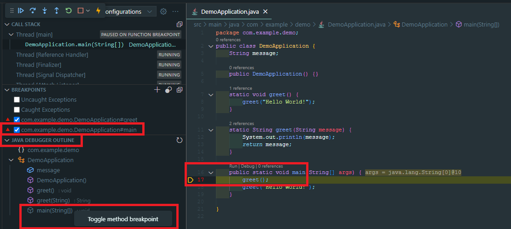
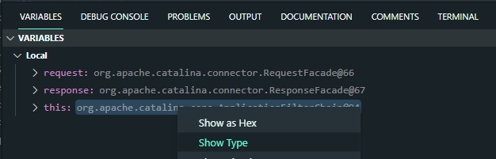
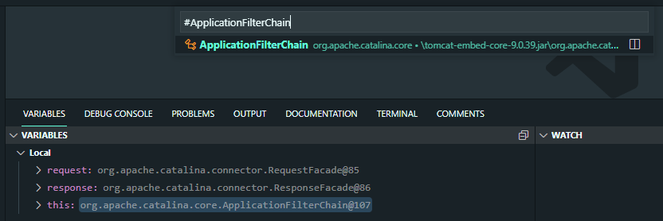

# vscode-java-debug-ext README

This extends the Debugger for Java VSCode extension.

## Features

---
COMING SOON: Java Debugger outline view.



This will allow setting:

- Class load breakpoint [ClassPrepareRequest](https://docs.oracle.com/en/java/javase/17/docs/api/jdk.jdi/com/sun/jdi/request/ClassPrepareRequest.html)
- Constructor and Method breakpoint
  - Overloaded constructors and methods
  - Constructors and methods Entry [MethodEntryRequest](https://docs.oracle.com/en/java/javase/17/docs/api/jdk.jdi/com/sun/jdi/request/MethodEntryRequest.html)
  - Constructors and methods Exit [MethodExitRequest](https://docs.oracle.com/en/java/javase/17/docs/api/jdk.jdi/com/sun/jdi/request/MethodExitRequest.html)
- Field watchpoint
  - Access watchpoint [AccessWatchpointRequest](https://docs.oracle.com/en/java/javase/17/docs/api/jdk.jdi/com/sun/jdi/request/AccessWatchpointRequest.html)
  - Modification watchpoint [ModificationWatchpointRequest](https://docs.oracle.com/en/java/javase/17/docs/api/jdk.jdi/com/sun/jdi/request/ModificationWatchpointRequest.html)
---

UPDATE: For innert types shows all outer types as well.

UPDATE: Use fully qualified name for types.


Adds the following command(s):

|Command Name|Command ID|Description|
|-|-|-|
|```Show Type```|```vscode-java-debug-ext.showType```|Show the Open Type quick pick for type of the variable node. If the type of variable is inner type it may first prompt for each of the parent types and the innermost type.|
|```Show Type of Container```|```vscode-java-debug-ext.showTypeOfContainer```|Show the Open Type quick pick for type of the parent of variable node. If the type of container of variable is inner type it may first prompt for each of the parent types and the innermost type.|

This basically addresses [Provide "Open type" button in variables' menu](https://github.com/microsoft/vscode-java-debug/issues/1104)




## Known Issues

This works well when ```toString()``` for Object types is disabled in Variables view.

## Requirements

Requires extention  [Debugger for Java](https://marketplace.visualstudio.com/items?itemName=vscjava.vscode-java-debug) (```vscjava.vscode-java-debug```)

## Extension Settings

None.

